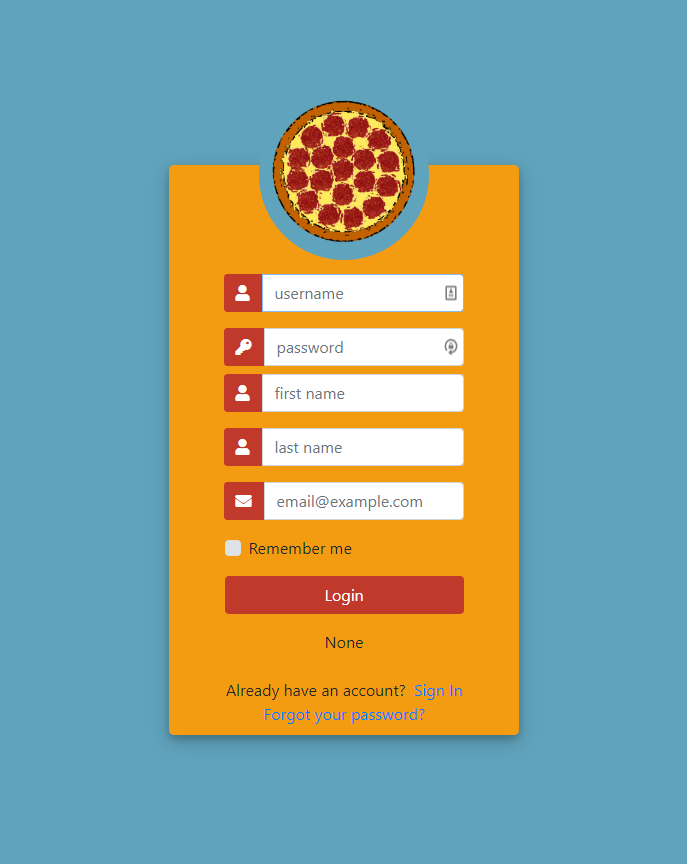
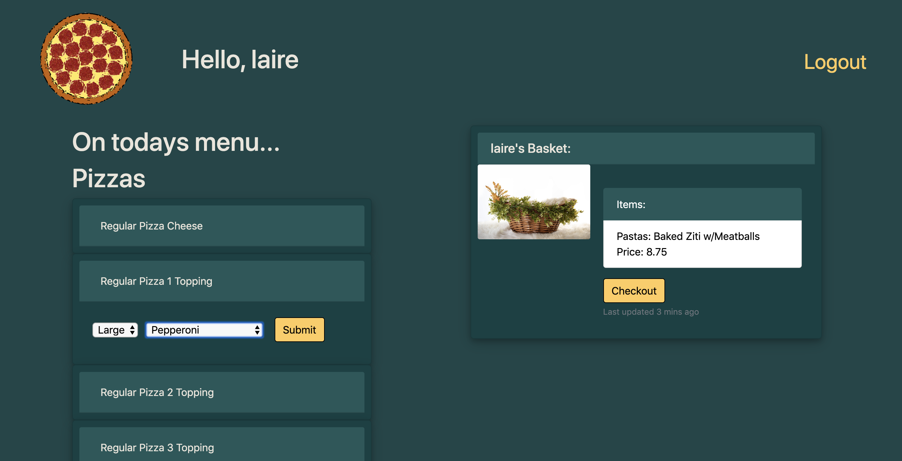
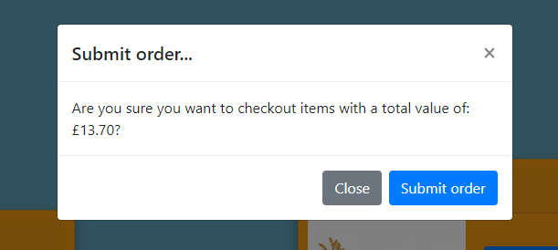
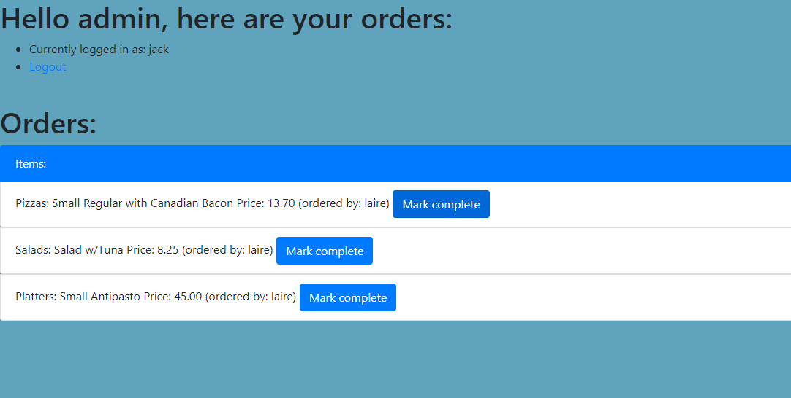

# Project PizzaShop

This is an example pizza shop website which allows you do order custom pizzas, subs, pastas, salads and platters of food!

You can intuitively add items to your basket and proceed through to checkout.

Register a user using the registration page and then login!

If you are an admin user you are able to add new items to the site through the Django admin panes as well as view and mark orders complete using the built-in admin page (which you will be taken to on login).

## Registration Screen

## Menu and ordering!

## Confirm your basket and checkout

## Admin panel - marking orders complete

Enjoy!
